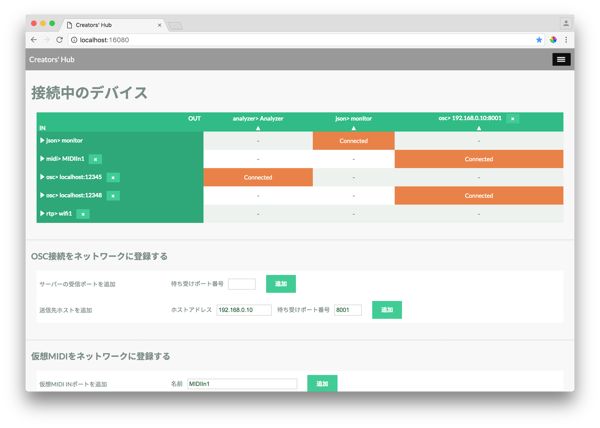

# Creators' Hub
Creators' Hubは異なるプロトコルやアプリケーションのメッセージを相互に変換するプログラムです。現在MIDI, OSC, JSON(WebSocket)の相互変換が実装されています。変換ルールを本リポジトリでオープンに議論・定義していくことで、音楽や映像アプリケーション間の接続性や汎用性を高め、様々なメディア・デバイスが連動したクリエーションをより容易にします。

## 動作方法

- node.js: v6.1.0

prgフォルダに移動してnpm install後、server.jsを実行します。

```js
cd prg
npm install
node server.js
```

16080番ポートでWebサーバーが立ち上がります。ブラウザでlocalhost:16080に接続して下さい。

## 使い方



IN（縦列）とOUT（横列）の交点をクリックして、入力と出力をつなぎます。入力から出力へのフォーマット変換は自動で実行されます。変換ルールは[doc/README](doc/README.md)で確認できます。

デバイスやアプリケーションの接続方法は[doc/connect](doc/connect.md)をご覧ください。

### 対応プロトコル

以下のプロトコル間を相互変換します。

- MIDI, rtp-MIDI
- Open Sound Control
- JSON(Web Socketを流れる特定形式のJSON)

変換ルールは[doc/README](doc/README.md)よりご確認下さい。

## リポジトリのフォルダ構成

- deploy --- githubpagesで配布するzip生成コマンド
- doc --- ドキュメント
- example --- Creators' Hubと接続するサンプルアプリケーション
- prg --- ソースコード

## ソースコード/変換ルールの検討方法

### ソースコードへの機能追加

Creators' Hubは[Git-flow](http://nvie.com/posts/a-successful-git-branching-model/)にしたがってブランチを管理しています。以下の手順で機能ごとにソースコードを書いてPull Requestをつくってください。

1. リポジトリをフォークする
2. フィーチャーブランチを作成する
3. 変更をコミットする
4. フィーチャーブランチをプッシュする
5. Pull Requestを出す

### プロトコル間の変換ルールの検討

既存のIssueを確認し、議題が無い場合は新たなIssueを追加します。

以下の様なトピックを歓迎します。

- 変換ルールの仕様変更、拡張
- 取り扱うプロトコルの追加

## License

Creators' Hub program is available under the [MIT LICENSE](./LICENSE).
