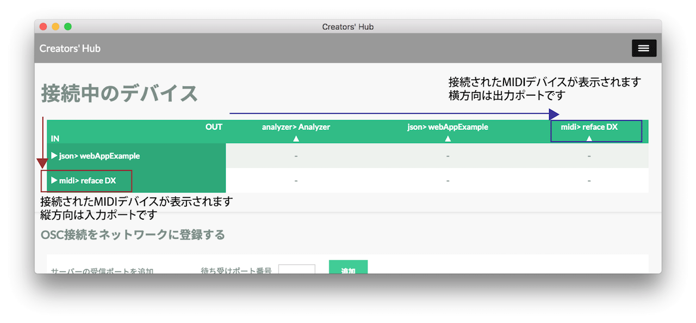
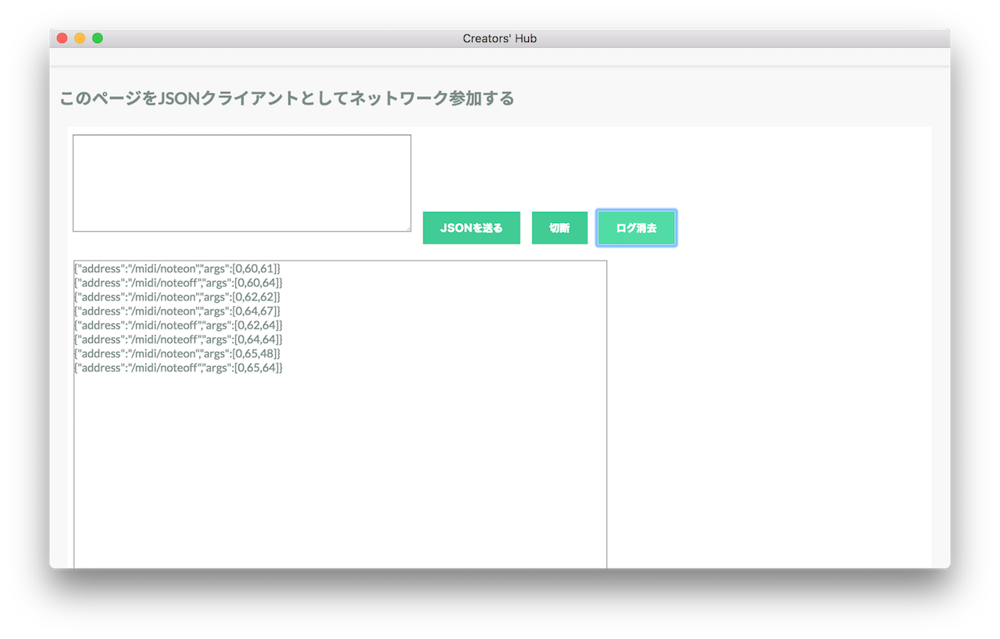
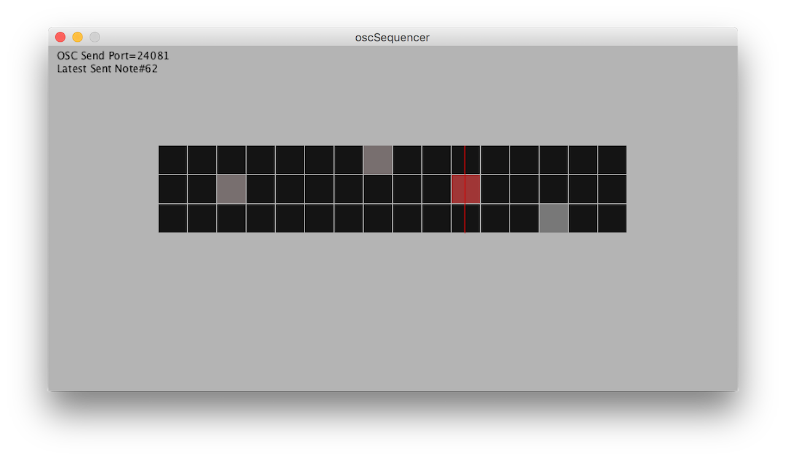
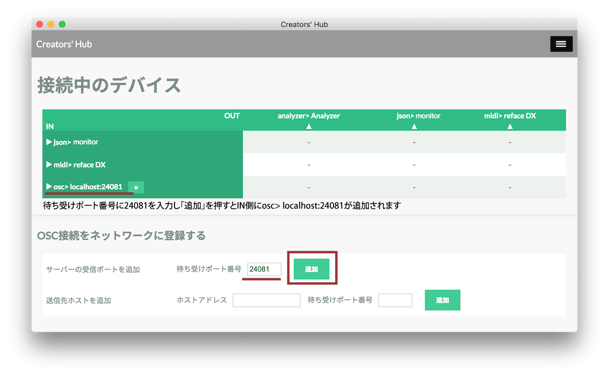
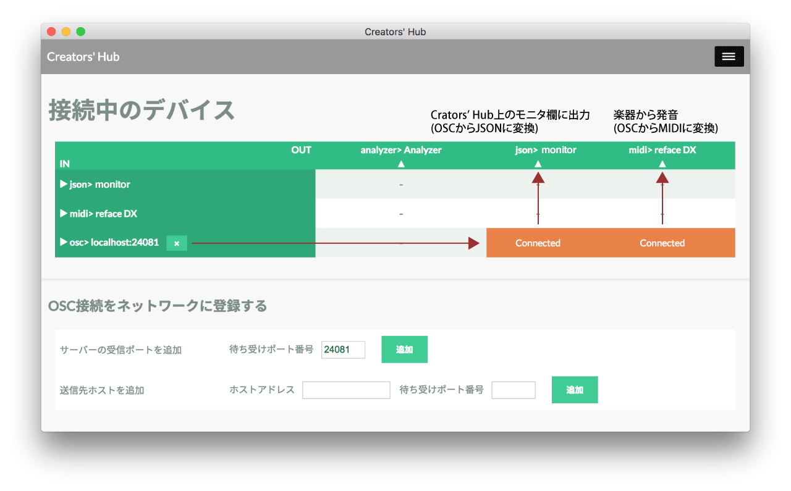
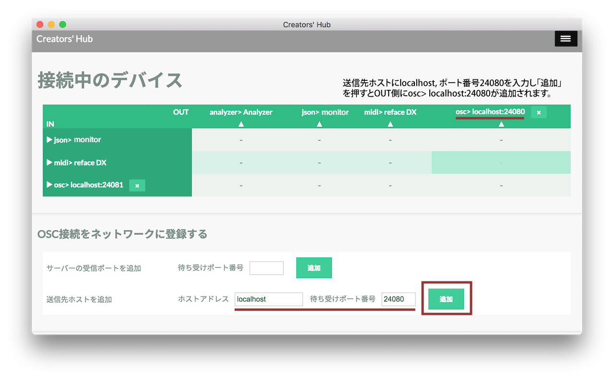
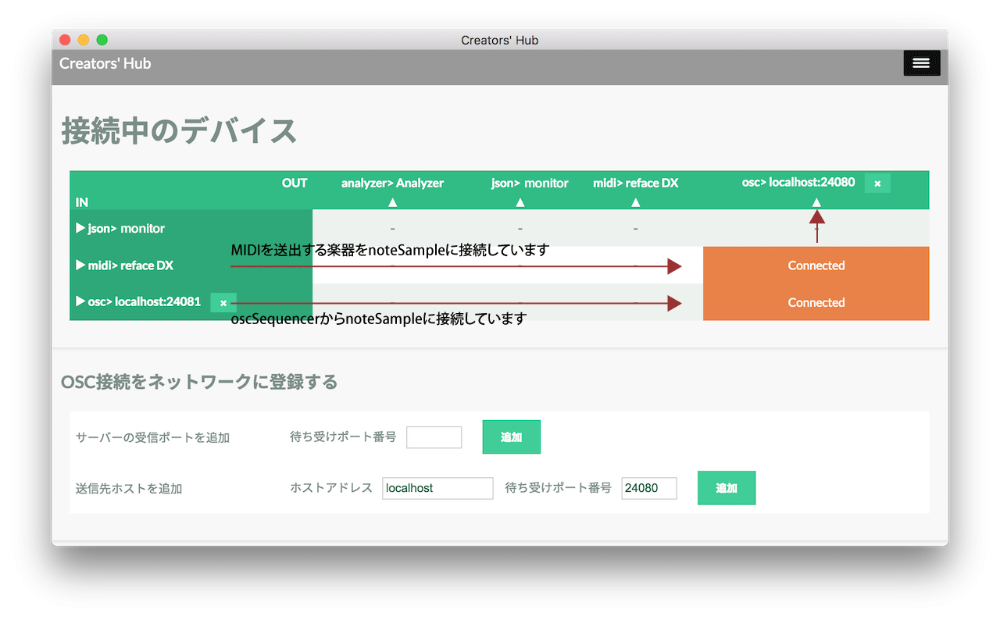
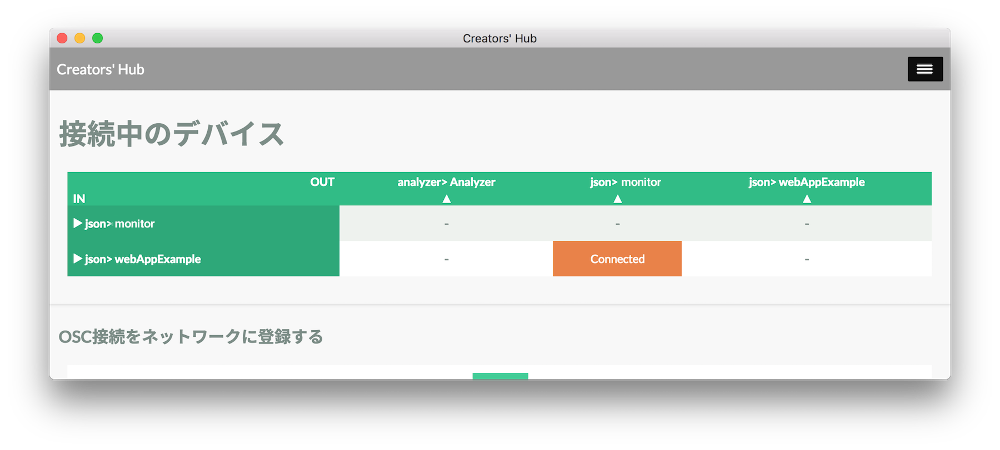
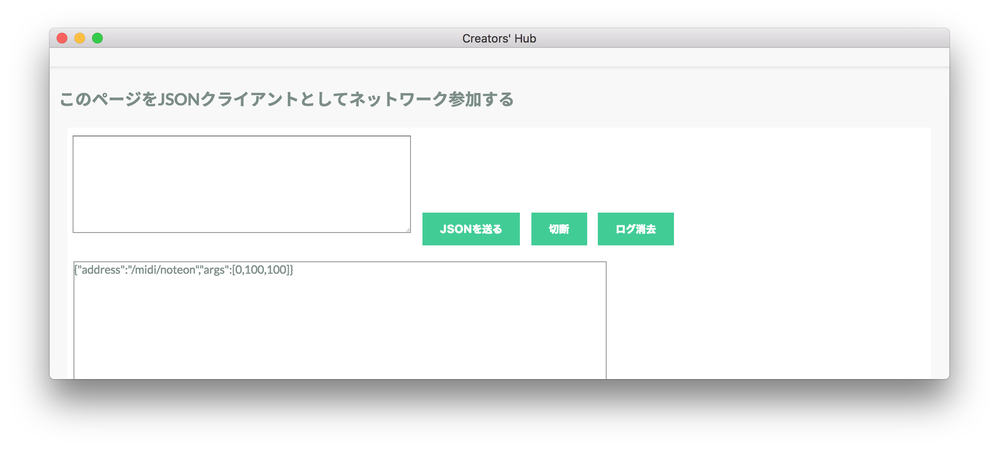

# 各種デバイスの接続方法

Creators' HubはMIDI・OSC・WebSocket上を流れるJSONを相互にデータ変換します。このドキュメントでは各プロトコルを実装したデバイスやアプリケーションを接続する方法を紹介します。

Creators' Hubを起動します。

```js
cd prg
npm install
node server.js
```

（注：Creators' Hubは16080ポートで動作するサーバアプリケーションです。16080ポートが使用されている場合起動できません。prg/serverHost.jsでポート番号を書き換えることで対応できます）

## MIDIデバイスの接続

MIDIデバイス（MIDIを実装した電子楽器やMIDIコントローラー等）を接続すると、自動的にリストアップされます。マトリクスの縦方向が入力ポート、横方向が出力ポートです。下の画像はコンピュータにシンセサイザーreface DXを接続した時の表示です。



Creators' Hubには入力されたデータをモニタする機能があります。「このページをJSONクライアントとして追加する」の「参加」ボタンを押すとマトリクスに「json> monitor」が追加されます。


最初に接続したMIDIデバイス（reface DX）の入力とjson> monitorの出力を接続します。マトリクス上の交点をクリックするとConnectedと表示されます。



以上の例では物理デバイスを接続しましたが、Creators' Hubはこの他に仮想MIDIポート、RTP-MIDIを追加できます。仮想MIDIポートを通じてDAWソフトウェアとデータを送受信したり、RTP-MIDIでWi-Fi経由でMIDIの送受信が可能です。

## OSCアプリケーションの接続

Cereators' Hubに同梱のサンプルアプリケーションを用いてOSCの接続方法を紹介します。

はじめにexample/visualize/p5/oscSequencer/binにあるzipファイル（win32, win64, macからご使用の環境に合わせて）を解凍し、フォルダ内のoscSequencerを実行して下さい。oscSequencerは3音のnoteOn, noteOffをMIDI-OSC変換ルールにもとづいたOSC形式で送出するシーケンサです。（このプログラムはProcessingで作成されており、ソースコードはexample/visualize/p5/oscSequencer/oscSequencer.pdeにあります。）



oscSequencerは24081番ポートにOSCを送信するので、Creators' Hub上でoscSequencerからのOSCを受信するため受信ポートを追加します。



MIDIデバイスの接続で追加したモニタに接続してみるとメッセージが届いていることを確認できます。MIDI楽器を接続している場合はその楽器と接続すると発音されます。



つぎにexample/visualize/p5/noteSample/binにあるzipファイル（win32, win64, macいずれか）を解凍し、フォルダ内のnoteSampleを実行して下さい。noteSampleはOSC形式のNoteOnを受信すると画面上に円を描画します。


noteSampleは24080番ポートでOSCを受信するので、Crators' Hub上に送信先ポートを追加します。



oscSequencerやMIDIを送出する楽器からnoteSampleに接続して発音すると、noteSample上に円が表示されます。



## JSONクライアントの接続

Cereators' HubはWebSocket上を流れるJSONをMIDI,OSCに変換できます。同梱のサンプルアプリケーションを用いてJSONクライアントの接続方法を紹介します。サンプルではsocket.ioを利用しています。

example/webApp内のindex.htmlをブラウザで実行して下さい。Creators' Hubのリストにjson>webAppExampleが追加されます。これはsocket.ioを利用してCreators' Hubに接続後、join_as_wsjsonというメッセージを送信することでリストに追加する仕様になっているためです。

```js
var gSocket = io.connect('http://localhost:16080');
gSocket.on("connect", function() {
  gSocket.emit('join_as_wsjson', {name: 'webAppExample'});
});
```

MIDIデバイスの接続で追加したjson> monitorと接続します。



index.htmlのClick!!ボタンをクリックします。


Crators' Hubのモニタ画面にJSON形式のNote Onメッセージが表示されます。


