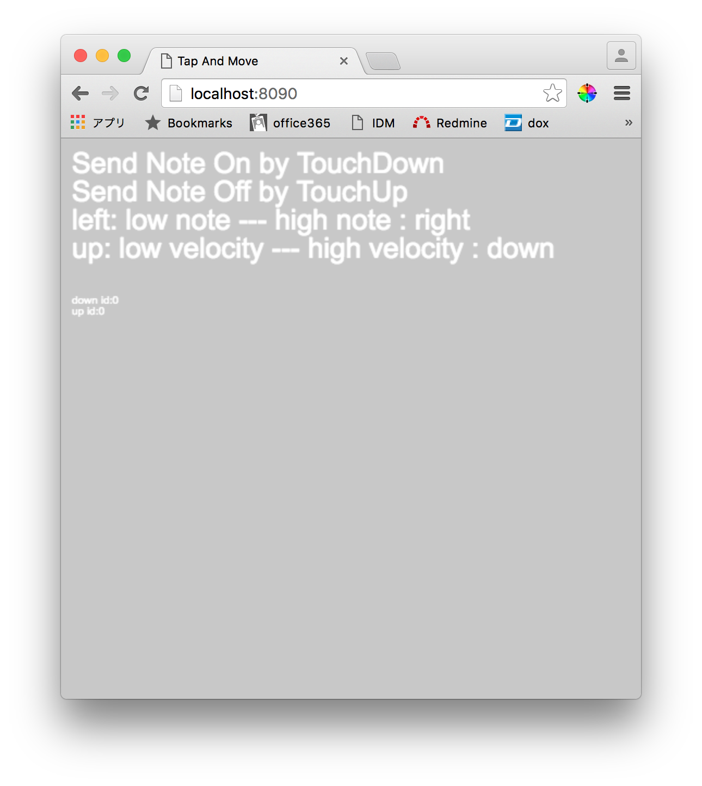

# Touch Example起動方法

```
npm install
node app.js
```

要node。以上でlocalhost:8090にサーバーが立ち上がる。ブラウザで接続し、グレーのcanvas領域をタップすることでnote onが発せられる。



# プログラム解説

## Creators' Hubへの接続

join_as_wsjsonを送信する。パラメータとしてnameを送るとその名前でMW1上に出現する。MIDI音源に接続し、操作を行うと発音する。

```js
socket.emit('join_as_wsjson', {name: 'Touch Example'});
```


## MIDIメッセージの送信

join_as_wsjsonで接続したソケットを使用してmessage_jsonを送信する。変換ルールは[MIDI-JSON 変換ルール](../../../../doc/midi-json.md)を参照。


### 送信例

```js
var ch = 1;
var notenum = 60;
var velocity = 100;
var noteArg = [ch, notenum, velocity];
var msg = {address:'/midi/noteon', args: noteArg};

socket.emit('message_json', msg);
```
